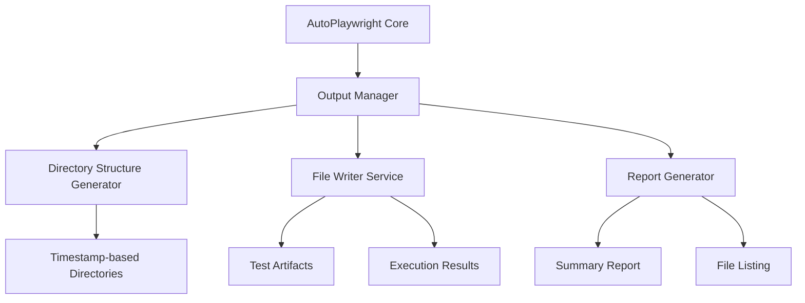

# AutoPlaywright テスト結果ディレクトリ管理機能 詳細仕様書

**作成日:** 2025-01-27  
**対応Issue:** [#1 【要件定義】テスト結果ディレクトリの再考](https://github.com/k-sakQA/autoplaywright/issues/1)  
**バージョン:** v1.0  

---

## 1. 概要

AutoPlaywrightにおけるテスト実行時に生成される各種アウトプットファイルを、構造化されたディレクトリ階層で自動管理する機能の詳細仕様書です。

---

## 2. アーキテクチャ設計

### 2.1 システム構成



### 2.2 モジュール構成

```
src/
├── output-manager/
│   ├── index.js                    # メインエントリーポイント
│   ├── directory-manager.js        # ディレクトリ構造管理
│   ├── file-writer.js              # ファイル書き込み処理
│   ├── report-generator.js         # レポート生成
│   ├── types/
│   │   ├── output-config.js        # 出力設定型定義
│   │   └── test-result.js          # テスト結果型定義
│   └── utils/
│       ├── path-resolver.js        # パス解決ユーティリティ
│       └── file-naming.js          # ファイル命名規則
```

---

## 3. ディレクトリ構造詳細設計

### 3.1 基本ディレクトリ構造

```
test-results/
├── runs/                           # 実行履歴管理
│   ├── {YYYY-MM-DD_HH-mm-ss}/     # 実行日時ディレクトリ
│   │   ├── config/                # テスト実行設定
│   │   │   ├── run-config.json    # 実行時設定情報
│   │   │   └── env-config.json    # 環境設定情報
│   │   ├── artifacts/             # テスト成果物
│   │   │   ├── test-points/       # テスト観点
│   │   │   ├── test-cases/        # テストケース
│   │   │   ├── scripts/           # 生成スクリプト
│   │   │   └── dom-snapshots/     # DOMスナップショット
│   │   ├── results/               # 実行結果
│   │   │   ├── reports/           # レポート類
│   │   │   ├── screenshots/       # スクリーンショット
│   │   │   ├── traces/            # トレースファイル
│   │   │   └── logs/              # ログファイル
│   │   └── metadata/              # メタデータ
│   │       ├── summary.json       # 実行サマリ
│   │       └── file-manifest.json # ファイル一覧
├── latest/                        # 最新実行結果（シンボリックリンク）
├── archives/                      # アーカイブ済み実行結果
└── .autoplaywright/               # 設定・キャッシュディレクトリ
    ├── templates/                 # テンプレートファイル
    └── global-config.json         # グローバル設定
```

### 3.2 ファイル命名規則

| ファイルタイプ | 命名規則 | 例 |
|---|---|---|
| テスト観点 | `test-points_{scenario_id}.{format}` | `test-points_login.json` |
| テストケース | `test-case_{case_id}.{format}` | `test-case_TC001.md` |
| Playwrightスクリプト | `{test_name}.spec.js` | `login_flow.spec.js` |
| DOMスナップショット | `snapshot_{test_id}_{step}.{format}` | `snapshot_TC001_step1.html` |
| スクリーンショット | `screenshot_{test_id}_{timestamp}.png` | `screenshot_TC001_20250127123456.png` |
| トレースファイル | `trace_{test_id}.zip` | `trace_TC001.zip` |
| ログファイル | `{log_type}_{timestamp}.log` | `execution_20250127123456.log` |

---

## 4. API設計

### 4.1 OutputManager クラス

```javascript
/**
 * @typedef {Object} OutputConfig
 * @property {string} baseDir
 * @property {boolean} enableArchiving
 * @property {number} maxRetentionDays
 * @property {boolean} compressionEnabled
 * @property {Object} formats
 * @property {'html'|'json'|'markdown'|'all'} formats.reports
 * @property {'png'|'jpg'} formats.screenshots
 * @property {boolean} formats.traces
 */

class OutputManager {
  /**
   * @param {OutputConfig} config
   */
  constructor(config) {}
  
  // 実行セッション開始
  /**
   * @param {string} [sessionId]
   * @returns {Promise<TestSession>}
   */
  async startSession(sessionId) {}
  
  // ファイル書き込み
  /**
   * @param {string} sessionId
   * @param {TestPoint[]} points
   * @returns {Promise<string>}
   */
  async writeTestPoints(sessionId, points) {}
  
  /**
   * @param {string} sessionId
   * @param {TestCase} testCase
   * @returns {Promise<string>}
   */
  async writeTestCase(sessionId, testCase) {}
  
  /**
   * @param {string} sessionId
   * @param {PlaywrightScript} script
   * @returns {Promise<string>}
   */
  async writeScript(sessionId, script) {}
  
  /**
   * @param {string} sessionId
   * @param {DOMSnapshot} snapshot
   * @returns {Promise<string>}
   */
  async writeDOMSnapshot(sessionId, snapshot) {}
  
  // 実行結果保存
  /**
   * @param {string} sessionId
   * @param {TestResult} result
   * @returns {Promise<void>}
   */
  async saveTestResult(sessionId, result) {}
  
  /**
   * @param {string} sessionId
   * @param {Buffer} screenshot
   * @param {ScreenshotMetadata} metadata
   * @returns {Promise<string>}
   */
  async saveScreenshot(sessionId, screenshot, metadata) {}
  
  /**
   * @param {string} sessionId
   * @param {Buffer} trace
   * @param {string} testId
   * @returns {Promise<string>}
   */
  async saveTrace(sessionId, trace, testId) {}
  
  /**
   * @param {string} sessionId
   * @param {LogEntry} log
   * @returns {Promise<void>}
   */
  async saveLog(sessionId, log) {}
  
  // レポート生成
  /**
   * @param {string} sessionId
   * @returns {Promise<TestReport>}
   */
  async generateReport(sessionId) {}
  
  /**
   * @param {string} sessionId
   * @returns {Promise<FileManifest>}
   */
  async generateFileListing(sessionId) {}
  
  // セッション終了・クリーンアップ
  /**
   * @param {string} sessionId
   * @returns {Promise<SessionSummary>}
   */
  async endSession(sessionId) {}
  
  /**
   * @param {string} sessionId
   * @returns {Promise<void>}
   */
  async archiveSession(sessionId) {}
  
  /**
   * @returns {Promise<void>}
   */
  async cleanupOldSessions() {}
}
```

### 4.2 DirectoryManager クラス

```javascript
class DirectoryManager {
  /**
   * @param {string} baseDir
   */
  constructor(baseDir) {}
  
  // ディレクトリ作成
  /**
   * @param {string} sessionId
   * @returns {Promise<string>}
   */
  async createSessionDirectory(sessionId) {}
  
  /**
   * @param {string} sessionPath
   * @returns {Promise<DirectoryStructure>}
   */
  async createArtifactDirectories(sessionPath) {}
  
  /**
   * @param {string} sessionPath
   * @returns {Promise<DirectoryStructure>}
   */
  async createResultDirectories(sessionPath) {}
  
  // パス解決
  /**
   * @param {string} sessionId
   * @param {ArtifactType} artifactType
   * @param {string} filename
   * @returns {string}
   */
  resolveArtifactPath(sessionId, artifactType, filename) {}
  
  /**
   * @param {string} sessionId
   * @param {ResultType} resultType
   * @param {string} filename
   * @returns {string}
   */
  resolveResultPath(sessionId, resultType, filename) {}
  
  // ディレクトリ管理
  /**
   * @param {string} path
   * @returns {Promise<void>}
   */
  async ensureDirectoryExists(path) {}
  
  /**
   * @param {string} target
   * @param {string} linkPath
   * @returns {Promise<void>}
   */
  async createSymbolicLink(target, linkPath) {}
  
  // クリーンアップ
  /**
   * @param {string} sourcePath
   * @param {string} archivePath
   * @returns {Promise<void>}
   */
  async archiveDirectory(sourcePath, archivePath) {}
  
  /**
   * @param {number} retentionDays
   * @returns {Promise<string[]>}
   */
  async deleteOldDirectories(retentionDays) {}
}
```

---

## 5. データ型定義

### 5.1 コア型定義

```javascript
/**
 * @typedef {Object} TestSession
 * @property {string} sessionId
 * @property {Date} startTime
 * @property {SessionConfig} config
 * @property {string} basePath
 * @property {'running'|'completed'|'failed'|'archived'} status
 */

/**
 * @typedef {Object} TestPoint
 * @property {string} id
 * @property {string} category
 * @property {string} description
 * @property {'high'|'medium'|'low'} priority
 * @property {boolean} automatable
 */

/**
 * @typedef {Object} TestCase
 * @property {string} id
 * @property {string} title
 * @property {string} description
 * @property {TestStep[]} steps
 * @property {string[]} expectedResults
 * @property {string[]} testPointIds
 */

/**
 * @typedef {Object} PlaywrightScript
 * @property {string} id
 * @property {string} testCaseId
 * @property {string} filename
 * @property {string} content
 * @property {'javascript'} language
 */

/**
 * @typedef {Object} DOMSnapshot
 * @property {string} testId
 * @property {number} stepNumber
 * @property {string} url
 * @property {string} html
 * @property {Buffer} [screenshot]
 * @property {Date} timestamp
 */
```

### 5.2 実行結果型定義

```javascript
/**
 * @typedef {Object} TestResult
 * @property {string} testId
 * @property {'passed'|'failed'|'skipped'|'timeout'} status
 * @property {number} duration
 * @property {Date} startTime
 * @property {Date} endTime
 * @property {TestError} [error]
 * @property {ScreenshotReference[]} screenshots
 * @property {string} [traceFile]
 * @property {LogEntry[]} logs
 */

/**
 * @typedef {Object} ScreenshotMetadata
 * @property {string} testId
 * @property {string} stepName
 * @property {Date} timestamp
 * @property {{width: number, height: number}} viewport
 * @property {string} url
 * @property {'step'|'failure'|'assertion'} type
 */

/**
 * @typedef {Object} TestReport
 * @property {string} sessionId
 * @property {TestSummary} summary
 * @property {TestResult[]} results
 * @property {Date} generatedAt
 * @property {FileManifest} fileManifest
 */
```

---

## 6. 設定仕様

### 6.1 グローバル設定ファイル

**ファイルパス:** `.autoplaywright/global-config.json`

```json
{
  "output": {
    "baseDirectory": "test-results",
    "sessionIdFormat": "YYYY-MM-DD_HH-mm-ss",
    "enableAutoArchiving": true,
    "retentionDays": 30,
    "compressionLevel": 6
  },
  "artifacts": {
    "testPoints": {
      "enabled": true,
      "format": "json"
    },
    "testCases": {
      "enabled": true,
      "format": "markdown"
    },
    "scripts": {
      "enabled": true,
      "language": "javascript"
    },
    "domSnapshots": {
      "enabled": true,
      "includeScreenshots": true,
      "compressionEnabled": true
    }
  },
  "results": {
    "reports": {
      "formats": ["html", "json"],
      "includeScreenshots": true,
      "includeTraces": true
    },
    "screenshots": {
      "format": "png",
      "quality": 90,
      "captureOnFailure": true,
      "captureOnStep": false
    },
    "traces": {
      "enabled": true,
      "includeNetworkData": true,
      "includeConsole": true
    },
    "logs": {
      "level": "info",
      "includeTimestamps": true,
      "separateErrorLog": true
    }
  }
}
```

### 6.2 セッション設定ファイル

**ファイルパス:** `{session}/config/run-config.json`

```json
{
  "sessionId": "2025-01-27_14-30-45",
  "startTime": "2025-01-27T14:30:45.123Z",
  "testTarget": {
    "url": "https://example.com",
    "scenarios": ["login", "shopping_cart"],
    "browsers": ["chromium", "firefox"]
  },
  "outputSettings": {
    "enableArtifacts": true,
    "enableResults": true,
    "compressionEnabled": true
  },
  "playwrightConfig": {
    "headless": true,
    "timeout": 30000,
    "retries": 2
  }
}
```

---

## 7. エラーハンドリング仕様

### 7.1 エラー分類

| エラータイプ | 対応レベル | 処理方針 |
|---|---|---|
| ディレクトリ作成失敗 | Critical | 処理停止、詳細ログ出力 |
| ファイル書き込み失敗 | Error | リトライ後、代替パスに保存 |
| 権限不足 | Error | 権限設定ガイド表示 |
| ディスク容量不足 | Warning | 古いファイル削除後リトライ |
| 設定ファイル不正 | Warning | デフォルト設定で継続 |

### 7.2 エラーログフォーマット

```json
{
  "timestamp": "2025-01-27T14:30:45.123Z",
  "level": "error",
  "category": "output-manager",
  "operation": "writeTestCase",
  "sessionId": "2025-01-27_14-30-45",
  "error": {
    "code": "FILE_WRITE_ERROR",
    "message": "Failed to write test case file",
    "details": {
      "filePath": "/path/to/test-case.md",
      "originalError": "EACCES: permission denied"
    }
  },
  "context": {
    "testCaseId": "TC001",
    "retryCount": 2
  }
}
```

---

## 8. パフォーマンス要件

### 8.1 レスポンス時間要件

| 操作 | 目標時間 | 最大許容時間 |
|---|---|---|
| セッション作成 | < 100ms | < 500ms |
| ファイル書き込み（< 1MB） | < 50ms | < 200ms |
| スクリーンショット保存 | < 200ms | < 1s |
| レポート生成 | < 2s | < 10s |
| セッション終了 | < 500ms | < 2s |

### 8.2 スケーラビリティ要件

- **同時セッション数:** 最大50セッション
- **ファイルサイズ制限:** 単一ファイル最大100MB
- **ディスク使用量:** セッションあたり最大1GB
- **メモリ使用量:** OutputManager最大256MB

---

## 9. セキュリティ要件

### 9.1 ファイルアクセス制御

- 出力ディレクトリは適切な権限設定（750）で作成
- 機密性の高いテストデータは暗号化オプション提供
- ファイルパストラバーサル攻撃対策実装

### 9.2 データ保護

- 個人情報を含む可能性のあるスクリーンショットの自動マスキング機能
- ログファイルからの機密情報自動除去
- アーカイブファイルの暗号化オプション

---

## 10. 実装フェーズ

### Phase 1: 基本機能実装（4週間）
- [ ] OutputManager基本クラス実装
- [ ] DirectoryManager実装
- [ ] 基本的なファイル書き込み機能
- [ ] 設定ファイル読み込み機能

### Phase 2: 拡張機能実装（3週間）
- [ ] レポート生成機能
- [ ] ファイル一覧・マニフェスト生成
- [ ] アーカイブ機能
- [ ] エラーハンドリング強化

---

## 11. テスト仕様

### 11.1 単体テスト

```javascript
describe('OutputManager', () => {
  describe('startSession', () => {
    it('should create session directory with correct structure');
    it('should generate unique session ID');
    it('should handle concurrent session creation');
  });

  describe('writeTestPoints', () => {
    it('should write test points in JSON format');
    it('should handle large test point lists');
    it('should validate test point data structure');
  });

  // 他のメソッドも同様にテスト
});
```

### 11.2 統合テスト

- 実際のPlaywrightテスト実行との連携テスト
- 大量ファイル生成時のパフォーマンステスト
- ディスク容量不足時の動作テスト
- 権限不足時のエラーハンドリングテスト

---

## 12. 運用・保守仕様

### 12.1 ログ監視

- 出力ディレクトリサイズ監視
- エラー率監視
- パフォーマンス指標監視

### 12.2 定期メンテナンス

- 古いセッションの自動アーカイブ（設定可能）
- ディスク使用量チェック・アラート
- 設定ファイルバリデーション

---

## 13. マイグレーション仕様

### 13.1 既存データ移行

既存のAutoPlaywrightユーザー向けに、従来の出力形式から新しいディレクトリ構造への移行ツールを提供。

```bash
# 移行コマンド例
autoplaywright migrate --from ./old-results --to ./test-results --format legacy
```

### 13.2 設定移行

従来の設定ファイルから新しい設定形式への自動変換機能を提供。

---

## 付録

### A. サンプル出力例

```
test-results/
├── runs/
│   └── 2025-01-27_14-30-45/
│       ├── config/
│       │   ├── run-config.json          # 実行設定
│       │   └── env-config.json          # 環境設定
│       ├── artifacts/
│       │   ├── test-points/
│       │   │   └── test-points_login.json
│       │   ├── test-cases/
│       │   │   ├── test-case_TC001.md
│       │   │   └── test-case_TC002.md
│       │   ├── scripts/
│       │   │   ├── login_flow.spec.js
│       │   │   └── cart_operations.spec.js
│       │   └── dom-snapshots/
│       │       ├── snapshot_TC001_step1.html
│       │       └── snapshot_TC001_step1.png
│       ├── results/
│       │   ├── reports/
│       │   │   ├── test-report.html
│       │   │   ├── test-report.json
│       │   │   └── summary.md
│       │   ├── screenshots/
│       │   │   └── screenshot_TC001_failure.png
│       │   ├── traces/
│       │   │   └── trace_TC001.zip
│       │   └── logs/
│       │       ├── execution.log
│       │       └── error.log
│       └── metadata/
│           ├── summary.json
│           └── file-manifest.json
└── latest -> runs/2025-01-27_14-30-45/
```

### B. 設定例

[設定ファイルサンプルは本文中に記載済み]

### C. エラーコード一覧

| コード | 説明 | 対応方法 |
|---|---|---|
| OUT_001 | ディレクトリ作成失敗 | 権限確認・パス確認 |
| OUT_002 | ファイル書き込み失敗 | ディスク容量確認 |
| OUT_003 | 設定ファイル不正 | 設定形式確認 |
| OUT_004 | セッションID重複 | システム時刻確認 |
| OUT_005 | アーカイブ処理失敗 | 権限・容量確認 |

---

**文書改版履歴**

| バージョン | 日付 | 変更内容 | 作成者 |
|---|---|---|---|
| v1.0 | 2025-01-27 | 初版作成 | システム | 